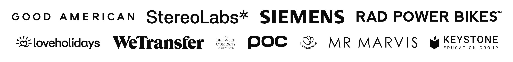

# 🍜 Logo Soup

A tiny framework-agnostic library that makes logos look good together. Works with React, Vue, Svelte, Solid, Angular, and vanilla JavaScript.




Read the full deep-dive: [The Logo Soup Problem (and how to solve it)](https://www.sanity.io/blog/the-logo-soup-problem)

## Install

```bash
npm install @sanity-labs/logo-soup
```

## Quick Start

### React

```tsx
import { LogoSoup } from "@sanity-labs/logo-soup/react";

function LogoStrip() {
  return (
    <LogoSoup
      logos={[
        { src: "/logos/acme.svg", alt: "Acme Corp" },
        { src: "/logos/globex.svg", alt: "Globex" },
        { src: "/logos/initech.svg", alt: "Initech" },
      ]}
    />
  );
}
```

The `<LogoSoup>` component handles everything. For custom layouts, use the hook directly:

```tsx
import { useLogoSoup } from "@sanity-labs/logo-soup/react";
import { getVisualCenterTransform } from "@sanity-labs/logo-soup";

function CustomGrid() {
  const { isLoading, normalizedLogos } = useLogoSoup({
    logos: ["/logo1.svg", "/logo2.svg"],
    baseSize: 48,
  });

  if (isLoading) return null;

  return (
    <div className="flex gap-4">
      {normalizedLogos.map((logo) => (
        
      ))}
    </div>
  );
}
```

#### Custom Image Component

Use `renderImage` to integrate with Next.js Image or add custom attributes:

```tsx
import Image from "next/image";
import { LogoSoup } from "@sanity-labs/logo-soup/react";

<LogoSoup
  logos={logos}
  renderImage={(props) => (
    <Image
      src={props.src}
      alt={props.alt}
      width={props.width}
      height={props.height}
    />
  )}
/>;
```

### Vue

```vue
<script setup>
import { ref } from "vue";
import { useLogoSoup } from "@sanity-labs/logo-soup/vue";
import { getVisualCenterTransform } from "@sanity-labs/logo-soup";

const logos = ref([
  { src: "/logos/acme.svg", alt: "Acme Corp" },
  { src: "/logos/globex.svg", alt: "Globex" },
]);

const { isLoading, isReady, normalizedLogos } = useLogoSoup({ logos });
</script>

<template>
  <div v-if="isReady">
    
  </div>
</template>
```

All options accept refs, plain values, or getter functions (`MaybeRefOrGetter`). The composable auto-tracks dependencies and re-processes when any option changes.

### Svelte

```svelte
<script>
  import { createLogoSoup } from "@sanity-labs/logo-soup/svelte";
  import { getVisualCenterTransform } from "@sanity-labs/logo-soup";

  let { logos = [] } = $props();

  const soup = createLogoSoup();

  $effect(() => {
    soup.process({ logos });
  });

  $effect(() => {
    return () => soup.destroy();
  });
</script>

{#if soup.isReady}
  {#each soup.normalizedLogos as logo (logo.src)}
    
  {/each}
{/if}
```

The Svelte adapter uses `createSubscriber` from `svelte/reactivity` (5.7+) under the hood, so reading properties like `soup.normalizedLogos` in an `$effect` or template automatically tracks changes.

### Solid

```tsx
import { useLogoSoup } from "@sanity-labs/logo-soup/solid";
import { getVisualCenterTransform } from "@sanity-labs/logo-soup";
import { For, Show } from "solid-js";

function LogoStrip() {
  const result = useLogoSoup(() => ({
    logos: ["/logos/acme.svg", "/logos/globex.svg"],
  }));

  return (
    <Show when={result.isReady}>
      <For each={result.normalizedLogos}>
        {(logo) => (
          
        )}
      </For>
    </Show>
  );
}
```

Options are passed as a getter function `() => ProcessOptions` so Solid can track reactive dependencies inside it.

### Angular

```typescript
import { Component, input, effect, inject } from "@angular/core";
import { LogoSoupService } from "@sanity-labs/logo-soup/angular";

@Component({
  selector: "logo-strip",
  standalone: true,
  providers: [LogoSoupService],
  template: `
    @for (logo of service.state().normalizedLogos; track logo.src) {
      
    }
  `,
})
export class LogoStripComponent {
  protected service = inject(LogoSoupService);
  logos = input.required<string[]>();

  constructor() {
    effect(() => {
      this.service.process({ logos: this.logos() });
    });
  }
}
```

`LogoSoupService` is an `@Injectable` scoped per component instance via `providers`. It uses Angular signals internally and cleans up automatically via `DestroyRef`.

### Vanilla JavaScript

Use the core engine directly, no framework needed:

```ts
import {
  createLogoSoup,
  getVisualCenterTransform,
} from "@sanity-labs/logo-soup";

const engine = createLogoSoup();

engine.subscribe(() => {
  const { status, normalizedLogos } = engine.getSnapshot();
  if (status !== "ready") return;

  const container = document.getElementById("logos")!;
  container.innerHTML = normalizedLogos
    .map((logo) => {
      const transform = getVisualCenterTransform(logo, "visual-center-y");
      return ``;
    })
    .join("");
});

engine.process({
  logos: ["/logos/acme.svg", "/logos/globex.svg", "/logos/initech.svg"],
});

// Clean up when done
// engine.destroy();
```

## Options

All options work the same across every framework. They're passed as component props (React), composable args (Vue), `process()` options (Svelte/Solid/Angular/Vanilla).

| Option              | Type                          | Default       | Description                                                                   |
| ------------------- | ----------------------------- | ------------- | ----------------------------------------------------------------------------- |
| `logos`             | `(string \| { src, alt? })[]` | required      | Array of logo URLs or objects with `src` and optional `alt`                   |
| `baseSize`          | `number`                      | `48`          | Target size in pixels                                                         |
| `scaleFactor`       | `number`                      | `0.5`         | Shape handling: `0` = uniform widths, `1` = uniform heights, `0.5` = balanced |
| `densityAware`      | `boolean`                     | `true`        | Scale dense logos down and light logos up                                     |
| `densityFactor`     | `number`                      | `0.5`         | How strong the density effect is (`0`-`1`)                                    |
| `cropToContent`     | `boolean`                     | `false`       | Crop whitespace/padding from logos                                            |
| `contrastThreshold` | `number`                      | `10`          | Minimum contrast for content detection                                        |
| `backgroundColor`   | `string \| [r,g,b]`           | auto-detected | Background color for contrast detection on opaque logos                       |

The React `<LogoSoup>` component also accepts:

| Option         | Type                   | Default             | Description                           |
| -------------- | ---------------------- | ------------------- | ------------------------------------- |
| `gap`          | `number \| string`     | `28`                | Space between logos                   |
| `alignBy`      | `AlignmentMode`        | `"visual-center-y"` | Alignment mode (see below)            |
| `renderImage`  | `(props) => ReactNode` | ``             | Custom image renderer                 |
| `className`    | `string`               | -                   | Container class name                  |
| `style`        | `CSSProperties`        | -                   | Container inline styles               |
| `onNormalized` | `(logos) => void`      | -                   | Callback when normalization completes |

### Alignment Modes

| Mode                | Description                               |
| ------------------- | ----------------------------------------- |
| `"bounds"`          | Align by geometric center (bounding box)  |
| `"visual-center"`   | Align by visual weight center (both axes) |
| `"visual-center-x"` | Visual center horizontally only           |
| `"visual-center-y"` | Visual center vertically only (default)   |

Use `getVisualCenterTransform(logo, mode)` to compute the CSS transform for a given logo and alignment mode. This is useful when building custom layouts with the hook/composable instead of the pre-built React component.

## How It Works

1. **Content Detection** — Analyzes each logo on a downscaled canvas to find true content boundaries, ignoring whitespace and padding baked into the image
2. **Aspect Ratio Normalization** — Applies [Dan Paquette's technique](https://www.sanity.io/blog/the-logo-soup-problem) using `scaleFactor` to balance wide vs tall logos
3. **Density Compensation** — Measures the pixel density (visual weight) of each logo and adjusts sizing so dense/bold logos don't overpower light/thin ones
4. **Irradiation Compensation** — Adjusts for the [Helmholtz irradiation illusion](https://en.wikipedia.org/wiki/Irradiation_illusion) where light content on dark backgrounds appears larger than it is

All processing happens client-side using canvas. No server, no AI, fully deterministic.

## Architecture

The library is a single package with subpath exports:

```
@sanity-labs/logo-soup          → Core engine, types, utilities, constants
@sanity-labs/logo-soup/react    → useLogoSoup hook + LogoSoup component
@sanity-labs/logo-soup/vue      → useLogoSoup composable
@sanity-labs/logo-soup/svelte   → createLogoSoup (runes-compatible)
@sanity-labs/logo-soup/solid    → useLogoSoup primitive
@sanity-labs/logo-soup/angular  → LogoSoupService (Injectable)
```

The core `createLogoSoup()` engine handles all image loading, measurement, normalization, caching, and cancellation. Each framework adapter is a thin wrapper (30-80 lines) that bridges the engine's `subscribe`/`getSnapshot` interface into the framework's reactivity model. Tree-shaking ensures a React consumer never pulls in Vue/Svelte/Solid/Angular code, and vice versa.

### The Core Engine

For advanced use cases or unsupported frameworks, use the engine directly:

```ts
import { createLogoSoup } from "@sanity-labs/logo-soup";

const engine = createLogoSoup();

// Subscribe to state changes
const unsubscribe = engine.subscribe(() => {
  const state = engine.getSnapshot();
  console.log(state.status, state.normalizedLogos);
});

// Trigger processing
engine.process({ logos: ["a.svg", "b.svg"], baseSize: 48 });

// Get current state synchronously
const { status, normalizedLogos, error } = engine.getSnapshot();

// Clean up
engine.destroy();
```

The engine's `subscribe(callback) → unsubscribe` + `getSnapshot()` shape is designed to plug into any reactivity system: React's `useSyncExternalStore`, Vue's `shallowRef`, Svelte's `createSubscriber`, Solid's `from()`, Angular's `signal()`, or your own.

## Development

```bash
bun install
bun test
bun run build
bun run storybook
```

## License

MIT
