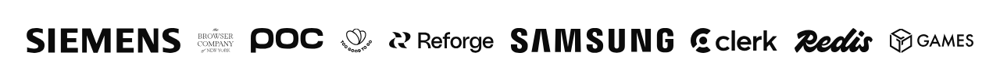
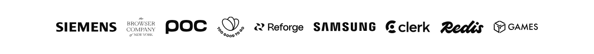

# 🍜 React Logo Soup

A tiny React library that makes logos look good together.

## The Problem

Real-world logos are messy. Some have padding, some don't. Some are dense and blocky, others are thin and airy. Put them in a row and they look chaotic.



React Logo Soup fixes this automatically.



Read the full deep-dive: [The Logo Soup Problem (and how to solve it)](https://www.sanity.io/blog/the-logo-soup-problem)

## Getting Started

```bash
npm install react-logo-soup
```

```tsx
import { LogoSoup } from "react-logo-soup";

function LogoStrip() {
  return (
    <LogoSoup
      logos={["/logos/acme.svg", "/logos/globex.svg", "/logos/initech.svg"]}
    />
  );
}
```

That's it! React Logo Soup will analyze each logo and normalize them to look visually balanced.

## Options

### `gap`

Space between logos. Default is `16`.

```tsx
<LogoSoup logos={logos} gap={24} />
```

### `baseSize`

How big the logos should be, in pixels. Default is `48`.

```tsx
<LogoSoup logos={logos} baseSize={64} />
```

### `densityAware` and `densityFactor`

React Logo Soup measures the "visual weight" of each logo. Dense, solid logos get scaled down. Light, thin logos get scaled up. This is on by default.

- `densityAware={false}` — Turn it off
- `densityFactor` — How strong the effect is (0 = off, 0.5 = default, 1 = strong)

```tsx
// Stronger density compensation
<LogoSoup logos={logos} densityFactor={0.8} />

// Turn it off
<LogoSoup logos={logos} densityAware={false} />
```

### `scaleFactor`

How to handle logos with different shapes (wide vs tall). Default is `0.5`.

Imagine you have two logos:

- Logo A: wide (200×100)
- Logo B: tall (100×200)

**scaleFactor = 0** → Same width for all logos

- Logo A: 48×24 (short)
- Logo B: 48×96 (very tall)

**scaleFactor = 1** → Same height for all logos

- Logo A: 96×48 (very wide)
- Logo B: 24×48 (narrow)

**scaleFactor = 0.5** → Balanced (default)

- Neither gets too wide nor too tall
- Looks most natural

```tsx
<LogoSoup logos={logos} scaleFactor={0.5} />
```

### `alignBy`

How to align logos. Default is `"bounds"`.

- `"bounds"` — Align by geometric center (bounding box)
- `"visual-center"` — Align by visual weight center (accounts for asymmetric logos)
- `"visual-center-x"` — Align by visual weight center horizontally only
- `"visual-center-y"` — Align by visual weight center vertically only

```tsx
<LogoSoup logos={logos} alignBy="visual-center" />
```

### `cropToContent`

When enabled, logos are cropped to their content bounds and returned as base64 images. This removes any whitespace/padding baked into the original image files. Default is `false`.

```tsx
<LogoSoup logos={logos} cropToContent />
```

## Using the Hook

For custom layouts, use the `useLogoSoup` hook directly:

```tsx
import { useLogoSoup } from "react-logo-soup";

function CustomGrid() {
  const { isLoading, normalizedLogos } = useLogoSoup({
    logos: ["/logo1.svg", "/logo2.svg"],
  });

  if (isLoading) return <div>Loading...</div>;

  return (
    <div className="grid">
      {normalizedLogos.map((logo) => (
        
      ))}
    </div>
  );
}
```

### `getVisualCenterTransform`

When using the hook, you can apply visual center alignment with the `getVisualCenterTransform` helper:

```tsx
import { useLogoSoup, getVisualCenterTransform } from "react-logo-soup";

function CustomGrid() {
  const { normalizedLogos } = useLogoSoup({ logos });

  return (
    <div className="grid">
      {normalizedLogos.map((logo) => (
        
      ))}
    </div>
  );
}
```

## Custom Image Component

Use with Next.js Image or any custom component:

```tsx
import Image from "next/image";

<LogoSoup
  logos={logos}
  renderImage={(props) => (
    <Image
      src={props.src}
      alt={props.alt}
      width={props.width}
      height={props.height}
    />
  )}
/>;
```

## How It Works

1. **Content Detection** — Analyzes each logo to find its true boundaries, ignoring whitespace and padding
2. **Aspect Ratio Normalization** — Scales logos based on their shape using the `scaleFactor`
3. **Density Compensation** — Measures pixel density and adjusts size so dense logos don't overpower light ones

All processing happens client-side using canvas. No AI, fully deterministic.

## Porting to Other Frameworks

The normalization core is plain JavaScript — React is just the wrapper. If you'd like to port Logo Soup to Vue, Svelte, Angular, or any other framework, go for it! We'd appreciate a link back to this repo, and let us know so we can link to your port from here.

## Development

```bash
bun install
bun test
bun run storybook
```

## License

MIT
